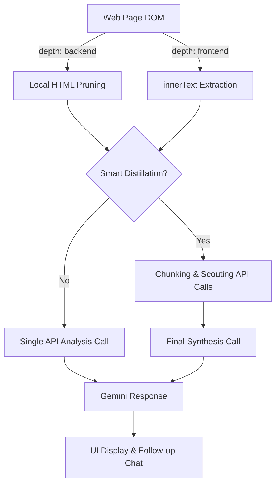

# Technical Architecture: Scan with AI Extension

This document provides a deep dive into the technical implementation of the "Scan with AI" extension, covering its components, data processing workflows, and integration with the Gemini API.

## 1. System Overview

The extension is a Chromium-based browser extension (Manifest V3) designed to analyze web page content using Google's Gemini AI. It supports two primary interaction modes: a **Browser Action Popup** and an **In-Page Overlay Modal**.

## 2. Component Architecture

### 2.1 UI Layer
*   **Extension Popup ([popup.html](file:///C:/Users/Michael/Documents/Chrome/Scan with AI/popup.html) / [popup.js](file:///C:/Users/Michael/Documents/Chrome/Scan with AI/popup.js))**: The primary entry point. It handles user settings, API key management, and triggers the scanning process using `chrome.scripting.executeScript`.
*   **In-Page Overlay ([content.js](file:///C:/Users/Michael/Documents/Chrome/Scan with AI/content.js))**: A shadow-DOM-like overlay injected into the current tab. It provides a more immersive chat experience and independent settings management.

### 2.2 Core Logic Service
*   **Gemini Analyzer ([gemini.js](file:///C:/Users/Michael/Documents/Chrome/Scan with AI/gemini.js))**: A centralized service class (`GeminiAnalyzer`) that handles all communication with the Generative Language API. It encapsulates the Map-Reduce logic, prompt engineering, and API error handling.

### 2.3 Data & Storage
*   **Storage Utility ([storage.js](file:///C:/Users/Michael/Documents/Chrome/Scan with AI/storage.js))**: A wrapper for `chrome.storage.local` providing Promise-based access to persistent data.
*   **Configuration**: Settings like API keys, scan depth, and distillation toggles are synchronized across `chrome.storage.sync` and `chrome.storage.local` for reliability.

### 2.4 Specialized Analyzers (Domain-Specific)
*   **Email Analyzer ([email_analyzer.js](file:///C:/Users/Michael/Documents/Chrome/Scan with AI/email_analyzer.js))**: Heuristic-based analysis for phishing keywords and urgency.
*   **Gmail Helper ([gmail.js](file:///C:/Users/Michael/Documents/Chrome/Scan with AI/gmail.js))**: Specialized scraper that prioritizes the Gmail API for raw email content before falling back to DOM scraping.

---

## 3. Key Technical Workflows

### 3.1 Advanced Content Extraction
The extension uses a multi-tier strategy to gather data:
1.  **Frontend Scan**: Extracts `innerText` from the main content container (or `document.body`).
2.  **Backend Scan**: Extracts `outerHTML` of the entire document.
3.  **Local Pruning**: Before transmission, the extension runs a `pruneHtml` function that clones the DOM and removes non-content elements (`<script>`, `<style>`, `<nav>`, `<footer>`, etc.) to reduce noise and token costs.

### 3.2 Smart Distillation (Map-Reduce)
To handle large pages without hitting context limits or incurring high latency, the extension implements a Map-Reduce pattern:
*   **Map (Scouting)**: The pruned text is split into ~15,000 character chunks. Each chunk is sent to Gemini with a "Distillation Prompt" to extract only unique and interesting points.
*   **Reduce (Synthesis)**: All interesting points from the "Map" phase are aggregated and sent to Gemini for a final, comprehensive summary.

### 3.3 Security Implementation
*   **API Key Management**: Keys are stored in secure browser storage.
*   **Masked UI**: The UI masks saved keys and provides validation routines to ensure the key is active before allowing a scan.
*   **Content Security**: DOM pruning ensures that sensitive script content or tracking pixels are not sent to the AI service.

---

## 4. Data Flow Diagram

## 5. Deployment & Environment
*   **Manifest Version**: 3
*   **API**: Google Generative Language API (Gemini 3.5 Flash Lite)
*   **Permissions**: `scripting`, `storage`, `activeTab`, `tabs`
